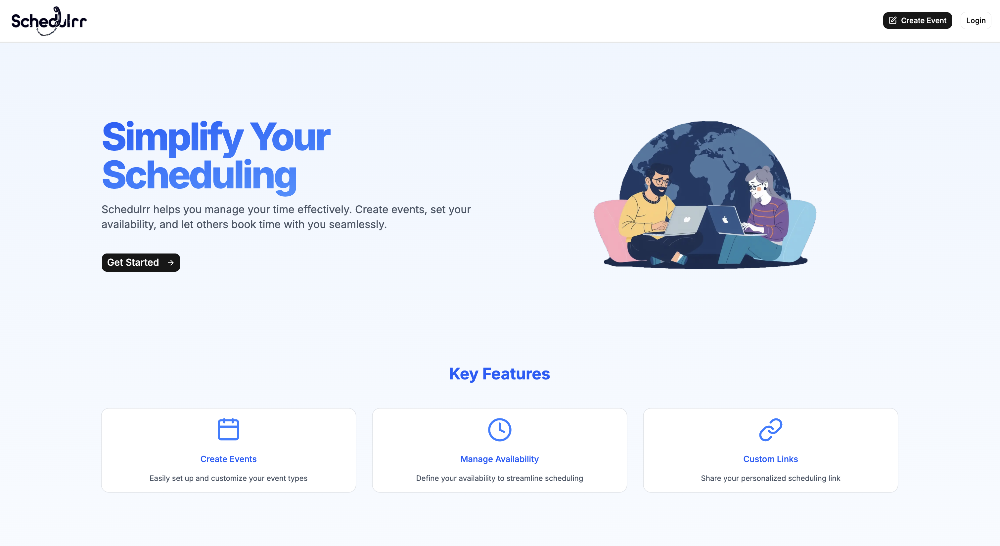
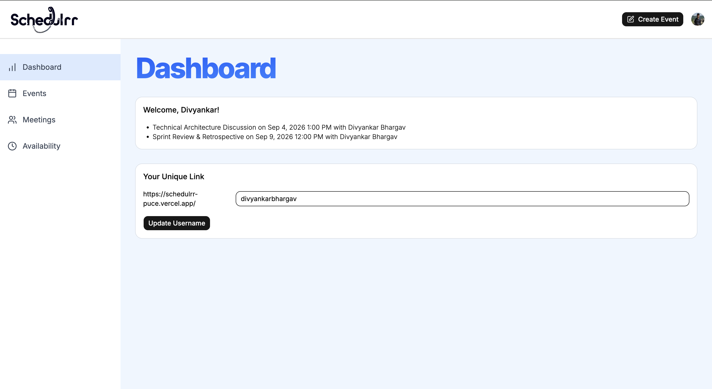
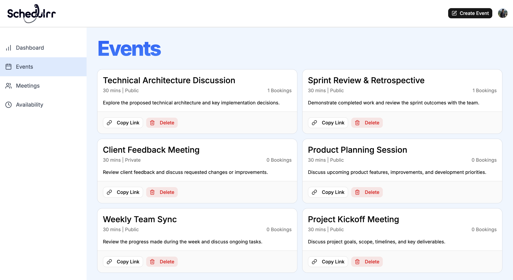
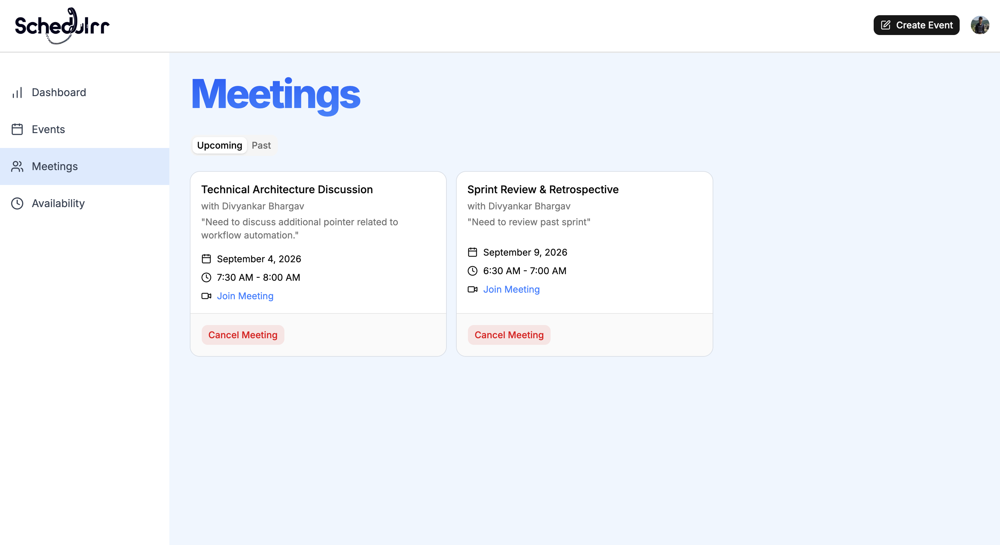
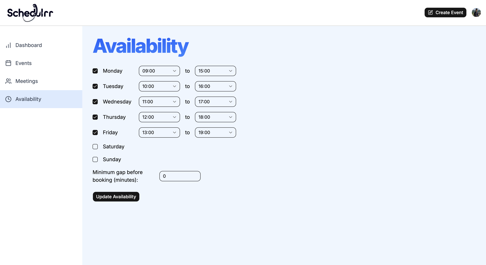
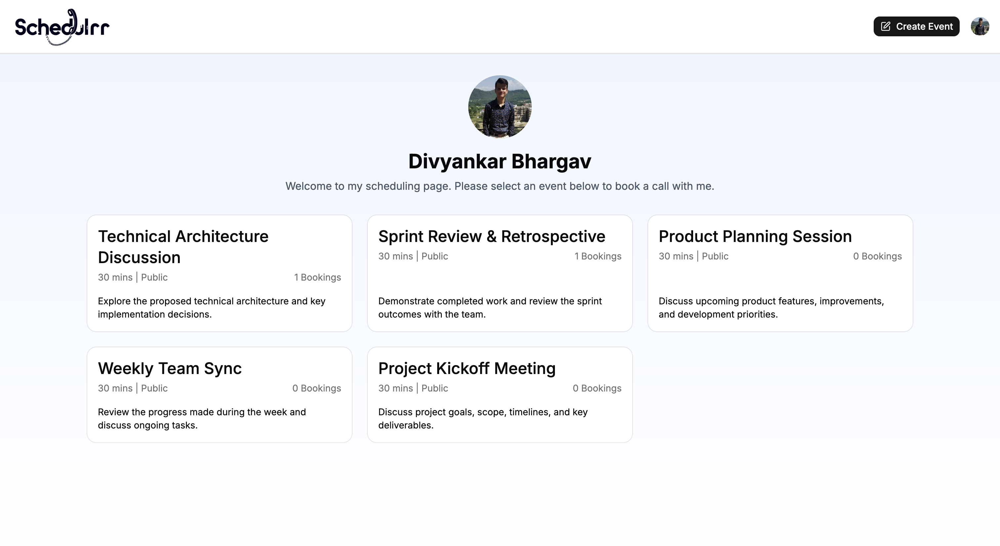
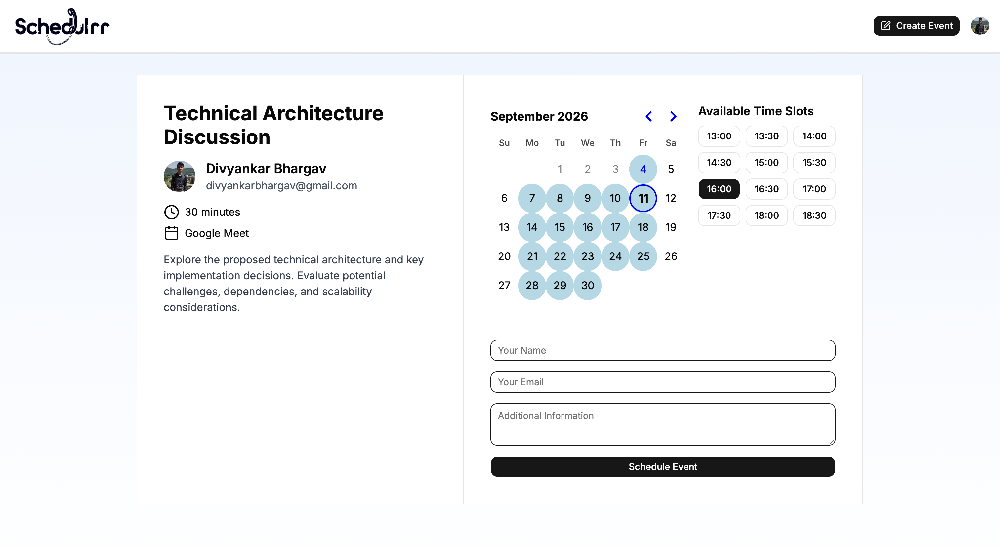
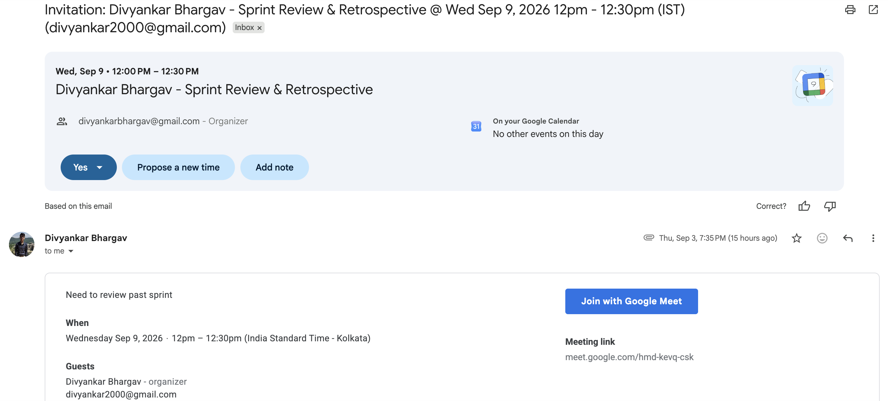

# 📅 Schedulrr — Meeting Scheduling

   
   

Schedulrr is a full-stack scheduling app that lets you publish your availability, share a personal booking link, and let clients or colleagues book time with you. Every confirmed booking creates a Google Calendar event with a Google Meet link and emails both sides — no back-and-forth required.

## 🌟 Features

### User Authentication

- **Sign in / Sign up** with [Clerk](https://clerk.com/) on custom hosted pages
- Clerk users are synced into PostgreSQL on first visit, with a username generated automatically
- Dashboard, events, meetings, and availability routes are protected by Clerk middleware

### Event Types

- Create events with a title, description, and duration
- Mark events **public** (listed on your profile) or **private** (link only)
- Quick-create drawer from anywhere via the header
- Copy a shareable booking link per event and see live booking counts
- Delete events you no longer offer

### Availability

- Set availability per weekday with start and end times
- Toggle individual days on or off
- Configure a **minimum gap** before a booking can be made
- Validated end-to-end with Zod so end time always follows start time

### Public Booking Flow

- Personal profile at `/your-username` listing your public events
- Booking page with a calendar for the next 30 days
- Time slots are generated from your availability, event duration, minimum gap, and existing bookings — so double bookings and past slots never appear

### Google Calendar & Meet

- Bookings create an event on the host's Google Calendar using their Clerk Google connection
- A **Google Meet** link is generated automatically and stored with the booking
- Invite emails go to both the host and the person booking
- Cancelling a meeting deletes the calendar event and notifies attendees

### Meetings & Dashboard

- **Upcoming** and **past** meetings in tabbed views
- Cancel upcoming meetings, with notes and Meet links shown per booking
- Dashboard shows your next meetings and lets you claim or update your unique booking link

## 🛠️ Technologies Used

- **Frontend**: Next.js (App Router), React, TypeScript, Tailwind CSS, Radix UI (shadcn)
- **Backend**: Next.js Server Actions
- **Database**: PostgreSQL ([Neon](https://neon.tech/)) with [Prisma](https://www.prisma.io/) ORM
- **Authentication**: Clerk
- **Calendar & Video**: Google Calendar API + Google Meet (`googleapis`)
- **Forms & Validation**: React Hook Form, Zod
- **Dates**: date-fns, React DayPicker
- **Hosting**: Vercel (recommended)

## 🚀 Getting Started

### Prerequisites

Before you begin, ensure you have:

- Node.js 20.9 or later and Yarn installed
- A PostgreSQL database (a free [Neon](https://neon.tech/) project works well)
- A [Clerk](https://clerk.com/) application with the **Google** social connection enabled
- Google Calendar scopes added to that Clerk connection so events and Meet links can be created

### Installation

1. **Clone the repository:**

```bash
git clone git@github.com:ScaryWings83289/schedulrr.git
cd schedulrr
```

2. **Install dependencies:**

```bash
yarn install
```

3. **Set up environment variables:** Create a `.env` file in the root directory and add the following:

```bash
# Clerk
NEXT_PUBLIC_CLERK_PUBLISHABLE_KEY=<your-clerk-publishable-key>
CLERK_SECRET_KEY=<your-clerk-secret-key>
NEXT_PUBLIC_CLERK_SIGN_IN_URL=/sign-in
NEXT_PUBLIC_CLERK_SIGN_UP_URL=/sign-up

# Database
DATABASE_URL=<your-postgresql-connection-string>
```

Google credentials are not needed here — Clerk stores the host's Google OAuth token and Schedulrr reads it server-side.

4. **Apply database migrations:**

```bash
npx prisma migrate dev
```

5. **Generate the Prisma client** (runs automatically after install, but useful after schema changes):

```bash
npx prisma generate
```

6. **Run the application:**

```bash
yarn dev
```

7. **Access the app:** Open [http://localhost:3000](http://localhost:3000) in your browser.

8. **Set your booking link:** Sign in, open the dashboard, and pick a username — your public page lives at `http://localhost:3000/your-username`.

## 📸 Screenshots

1. **Landing Page:**
   

2. **Dashboard** — upcoming meetings and your unique booking link
   

3. **Events** — create, share, and manage your event types
   

4. **Meetings** — upcoming and past bookings with cancel support
   

5. **Availability** — weekly schedule and minimum booking gap
   

6. **Public Profile** — your shareable page of public events
   

7. **Booking Page** — pick a date, choose a slot, and confirm
   

8. **Calendar Invite** — Google Calendar event with a Meet link
   

## 📁 Project Structure

```text
actions/           # Server actions (events, availability, bookings, meetings, users)
app/
  (auth)/          # Clerk sign-in & sign-up
  (main)/          # Dashboard, events, meetings, availability
  [username]/      # Public profile & event booking pages
components/        # Feature components + shadcn UI primitives
constants/         # Landing content, nav items, time slots
hooks/             # useFetch for server action calls
lib/               # Prisma client, Clerk user sync, Zod validators
prisma/            # Schema and migrations
```

## 🤝 Developed With

- [Visual Studio Code](https://code.visualstudio.com/) — source code editor with Git, debugging, and IntelliSense
- [Next.js](https://nextjs.org/) — the React framework for the web
- [Prisma](https://www.prisma.io/) — type-safe ORM for PostgreSQL
- [Neon](https://neon.tech/) — serverless PostgreSQL
- [Clerk](https://clerk.com/) — authentication and user management
- [Google Calendar API](https://developers.google.com/calendar) — calendar events and Meet links
- [Radix UI](https://www.radix-ui.com/) / [shadcn/ui](https://ui.shadcn.com/) — accessible UI primitives
- [Tailwind CSS](https://tailwindcss.com/) — utility-first CSS
- [React Hook Form](https://react-hook-form.com/) / [Zod](https://zod.dev/) — forms and schema validation
